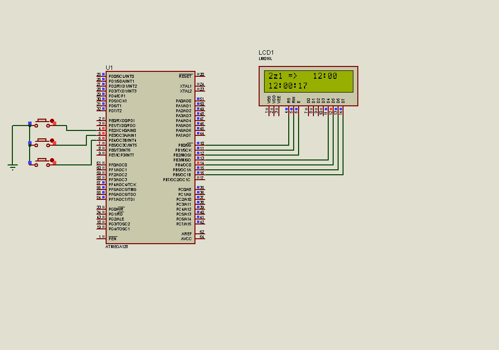

# **Industrial Grease Lubrication Timer – Embedded C**

---

## **Overview**
Designed and implemented an embedded timer system for industrial grease lubrication, controlling **28 independent motors** along production lines in **Rolling Mill 300, Esfahan Steel Company**.  
The system stabilizes industrial power fluctuations using **recycled computer power supplies**, minimizes noise, and ensures reliable operation in harsh environments.

---

## **Key Features**
- Control of **28 three-phase grease delivery motors**  
- Configurable start times from **10 minutes to 48 hours** via a **16x2 character LCD**  
- **Simple user interface** with only **3 buttons** for full configuration  
- **High timing accuracy** compared to legacy analog systems  
- Easy debugging and modifications via **Proteus simulation for AVR**  
- **Cost-effective** pre-PLC automation solution  

---

## **Technical Highlights**
- Embedded C programming on AVR microcontroller  
- **Isolated relay circuits** to protect the MCU from noise and unintended resets  
- Reliable automation with minimal cost and high performance  

---

## **Impact**
- Improved operational efficiency and energy savings  
- Significant reduction in grease consumption  
- User-friendly system operable by personnel with minimal technical experience  

---

## **Media**
**LCD Display Simulation:**

